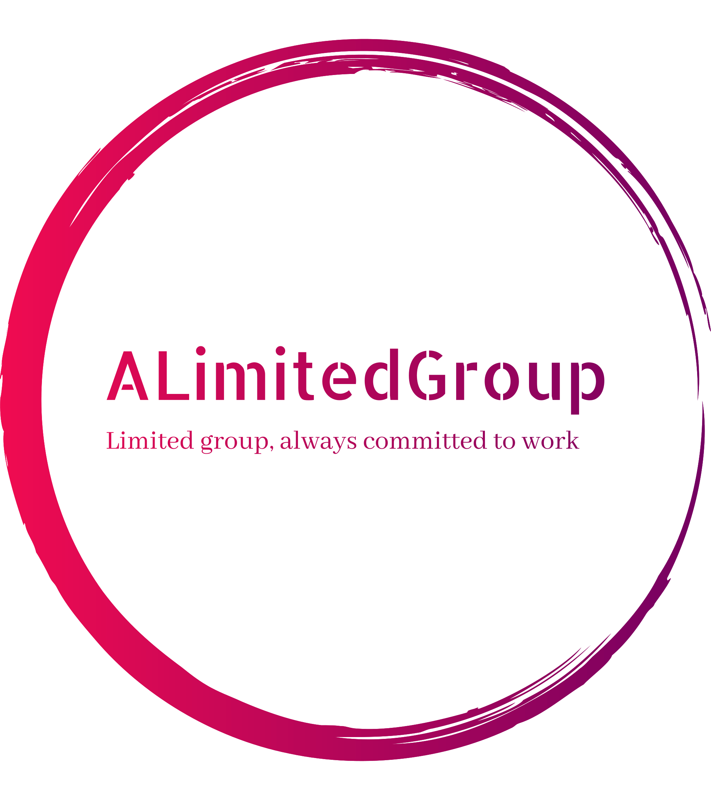

<p align="center">
  
</p>

# Documentazione del gruppo ALimitedGroup

Questa repository contiene la documentazione dell'ottavo gruppo del primo lotto
dell'A.A. 2024/2025, per il corso di Ingegneria del Software dell'Università di Padova.

## Setup

Si consiglia di utilizzare Visual Studio Code come editor,
installando l'estensione **Tinymist Typst**.
È presente un tasto "preview" grazie a questa estensione,
ma, qualora si volesse compilare un file da terminale,
il comando da eseguire (dalla cartella radice della repository) è:

```
typst compile --root . --ignore-system-fonts --font-path assets path/to/document.typ
```
